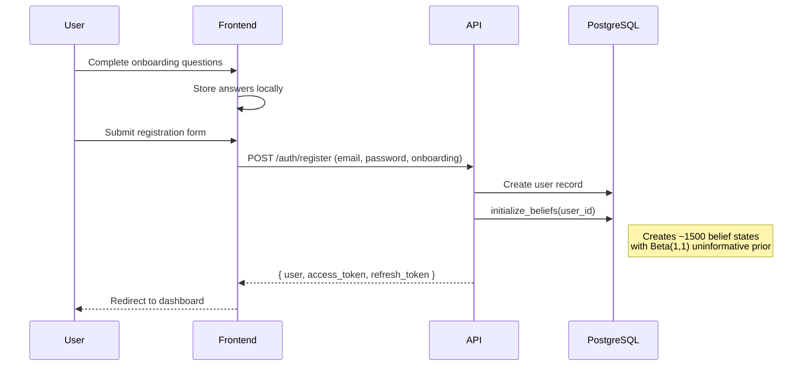
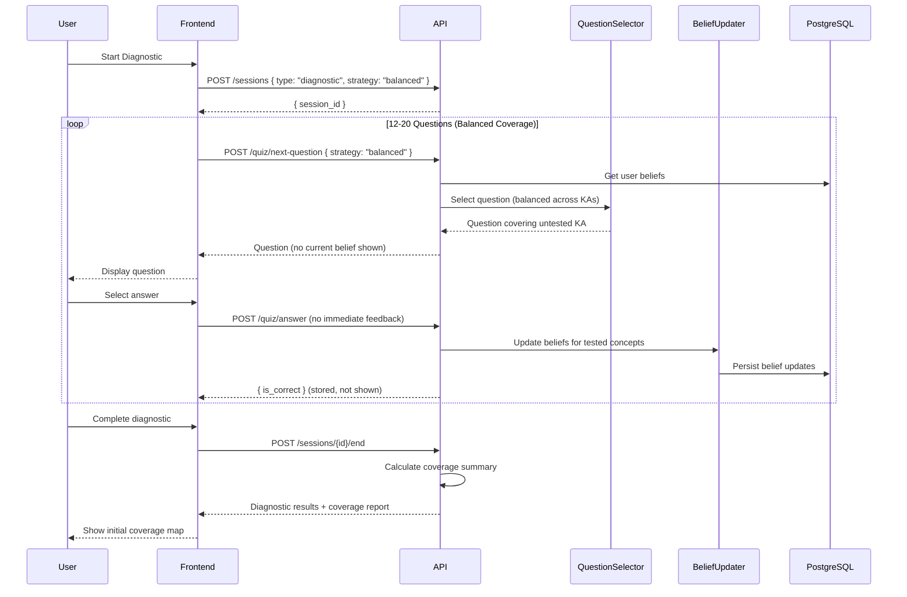
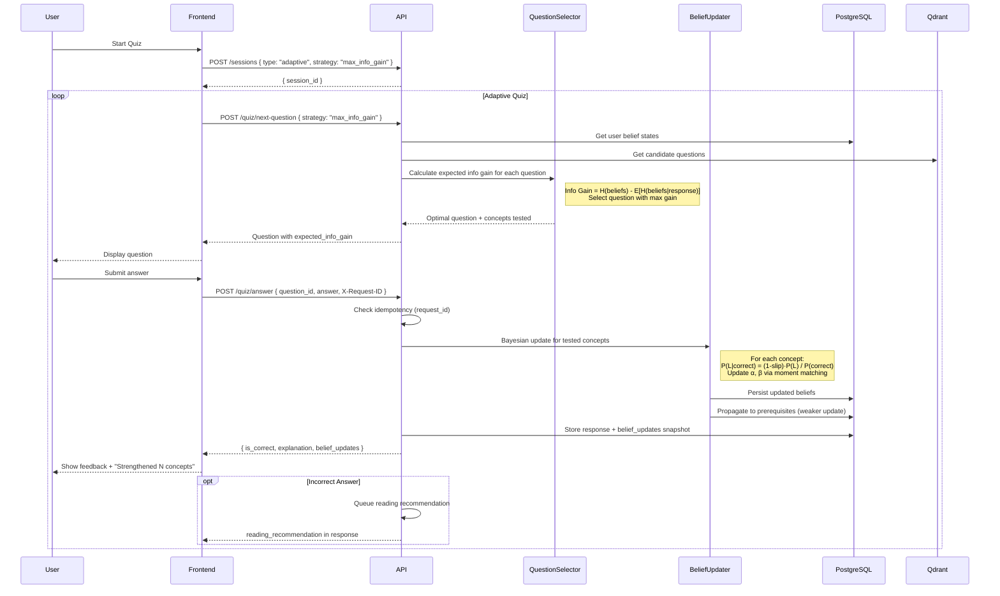
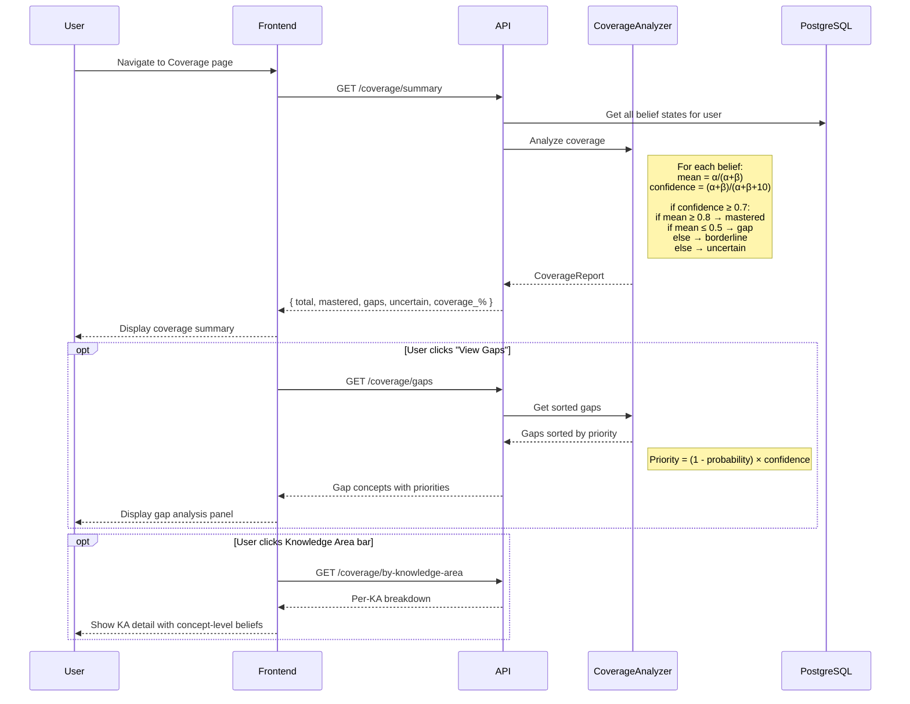
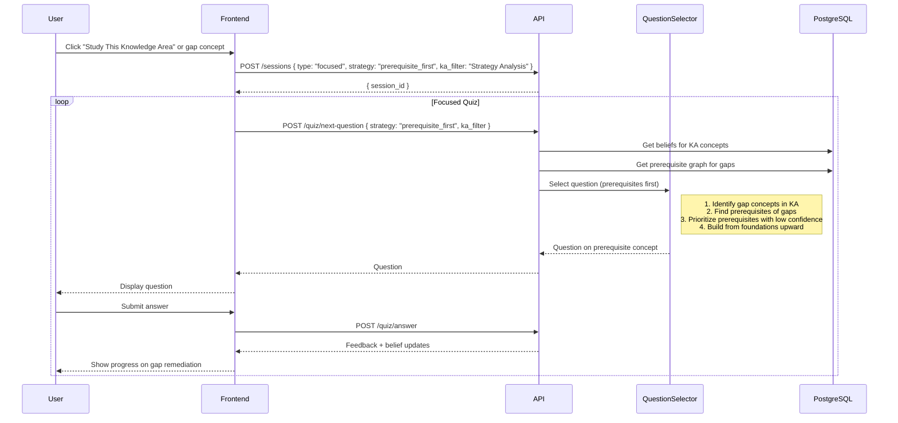
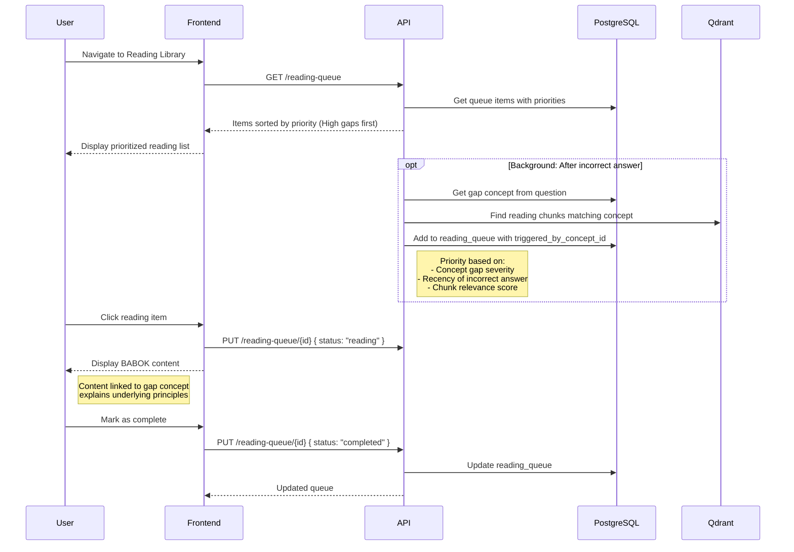
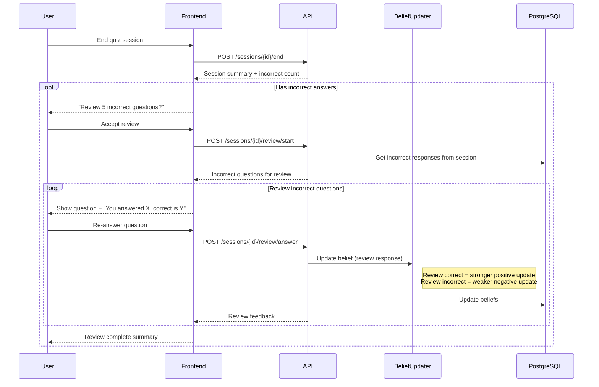
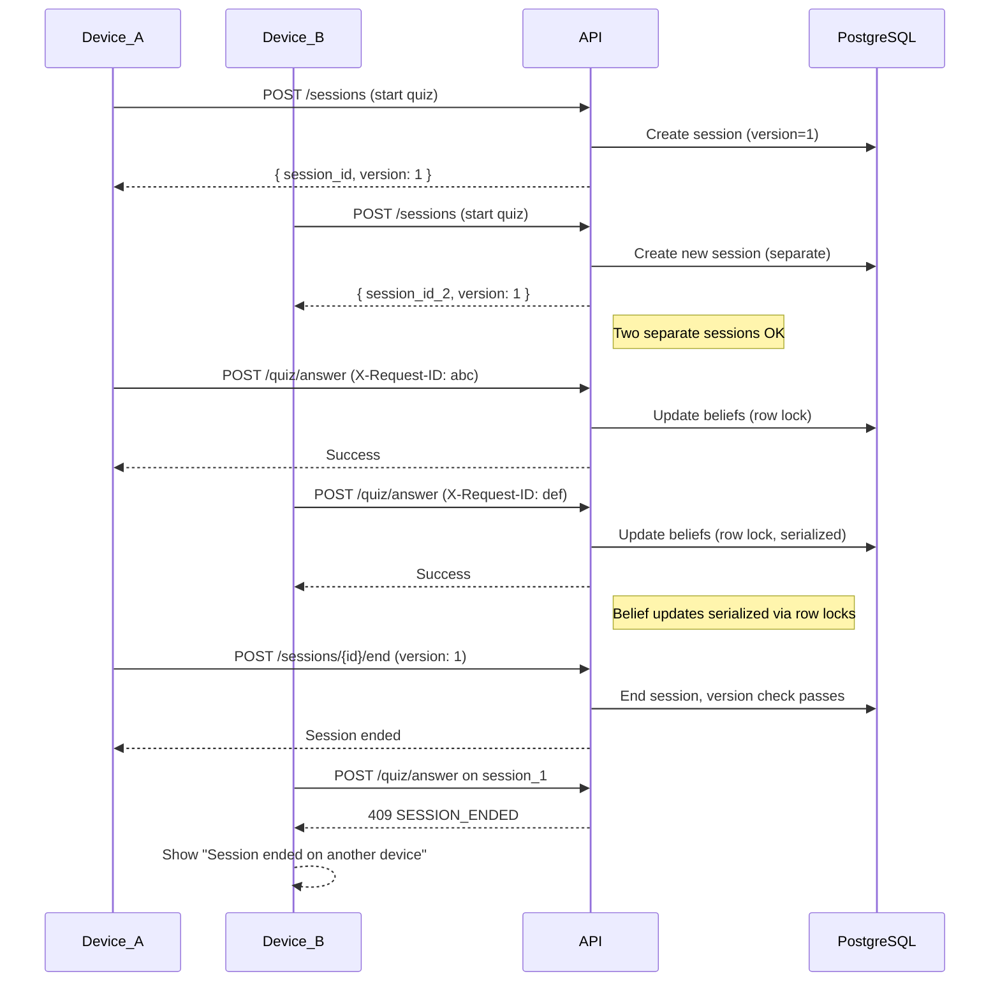

# Core Workflows

## Status

**ALIGNED** with BKT Architecture (bkt-architecture.md)

---

### Workflow 1: User Registration & Belief Initialization

User completes 7-question onboarding flow (anonymous), then creates account with onboarding data persisted to profile. Upon account creation, belief states are initialized for all concepts.



**Key Points:**
- All concepts initialized with Beta(1, 1) = uniform prior ("we know nothing")
- Belief initialization is synchronous (user waits ~1-2 seconds)
- User immediately ready for diagnostic assessment

---

### Workflow 2: Initial Diagnostic Assessment

User takes 12-20 question diagnostic using **balanced coverage** strategy to seed beliefs across all Knowledge Areas. No per-question feedback during assessment.



**Strategy: Balanced Coverage**
- Ensures questions cover all 6 Knowledge Areas evenly
- Seeds beliefs across the corpus for better subsequent selection
- No feedback during diagnostic to prevent learning bias

**Results Display:**
- Overall readiness score (aggregated from beliefs)
- Per-KA readiness breakdown
- Identified gaps (concepts with P(mastery) < 0.5 and high confidence)
- Estimated questions to full coverage

---

### Workflow 3: Adaptive Quiz with BKT Question Selection

User answers questions selected for **maximum information gain**. Each answer triggers Bayesian belief updates and returns immediate feedback.



**Question Selection: Max Information Gain**
```
For each candidate question Q:
  1. Get concepts C tested by Q
  2. Calculate current entropy H(beliefs) for C
  3. Simulate belief update if correct → H(beliefs|correct)
  4. Simulate belief update if incorrect → H(beliefs|incorrect)
  5. P(correct) = (1-slip)·mean + guess·(1-mean)
  6. Expected posterior entropy = P(correct)·H(correct) + P(incorrect)·H(incorrect)
  7. Info gain = H(current) - Expected posterior entropy

Select Q with maximum info gain
```

**Belief Update (Bayesian):**
```python
# On correct answer:
p_correct = (1 - slip) * p_mastered + guess * (1 - p_mastered)
posterior_mastered = (1 - slip) * p_mastered / p_correct
new_alpha = alpha + posterior_mastered
new_beta = beta + (1 - posterior_mastered)
```

---

### Workflow 4: Coverage Analysis & Gap Identification

User views their coverage report showing mastered concepts, gaps, and uncertain areas.



**Coverage Classification Thresholds:**
| Status | Criteria |
|--------|----------|
| Mastered | mean ≥ 0.8 AND confidence ≥ 0.7 |
| Gap | mean ≤ 0.5 AND confidence ≥ 0.7 |
| Borderline | 0.5 < mean < 0.8 AND confidence ≥ 0.7 |
| Uncertain | confidence < 0.7 |

---

### Workflow 5: Focused Study (Gap Remediation)

User focuses on a specific Knowledge Area or gap concept using **prerequisite-first** strategy.



**Prerequisite-First Strategy:**
1. Get gap concepts in target KA
2. Traverse prerequisite DAG to find foundational concepts
3. Check if prerequisites are mastered
4. If prerequisite uncertain/gap → ask about prerequisite first
5. Once prerequisites solid → ask about target gap

---

### Workflow 6: Reading Library with Gap-Linked Recommendations

User accesses reading library with items prioritized by gap concepts.



**Reading Priority Calculation:**
```
priority_score = (1 - concept_probability) × concept_confidence × chunk_relevance

High: priority_score > 0.6
Medium: 0.3 < priority_score ≤ 0.6
Low: priority_score ≤ 0.3
```

---

### Workflow 7: Post-Session Review (Reinforcement)

After completing a quiz session, user re-answers incorrect questions for reinforcement learning.



**Review Belief Updates:**
- Correct on review: Stronger evidence of learning (higher weight)
- Incorrect on review: Identifies persistent gap (add to high-priority reading)

---

### Workflow 8: Multi-Device Concurrent Access

User accesses LearnR from multiple devices; system handles concurrent sessions safely.



**Concurrency Guarantees:**
- Separate sessions allowed (no conflict)
- Belief updates use row-level locking (serialized)
- Session modifications use optimistic locking (version check)
- Duplicate submissions prevented via request_id

---

## Change Log

| Date | Version | Description | Author |
|------|---------|-------------|--------|
| 2025-12-03 | 2.0 | Aligned with BKT Architecture - updated all workflows for belief states, question selection strategies, coverage analysis | Winston (Architect) |
| 2025-11-01 | 1.0 | Initial core workflows | Original |
