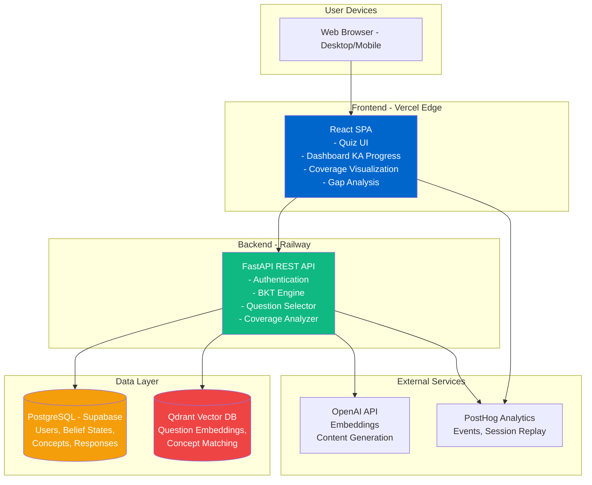
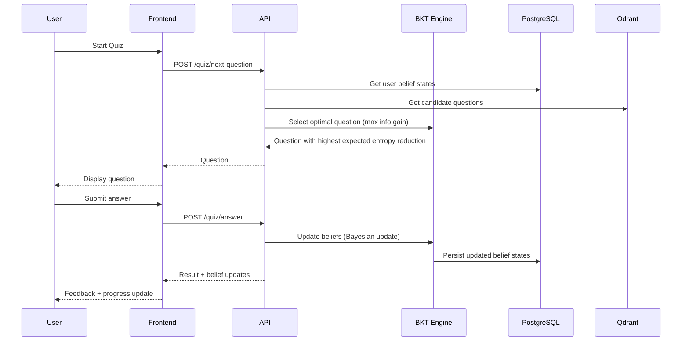

# High Level Architecture

## Status

**ALIGNED** with BKT Architecture (bkt-architecture.md) and Multi-Course Architecture (multi-course-architecture.md)

---

### Technical Summary

LearnR employs a **modern three-tier architecture** with clear separation between presentation (React SPA), business logic (FastAPI REST API), and data persistence (PostgreSQL + Qdrant). The system is designed as a **monolithic backend with microservice-ready boundaries**, allowing future decomposition if needed.

The architecture centers on a **Bayesian Knowledge Tracing (BKT) engine** that models each learner's knowledge as probability distributions over discrete concepts. Unlike traditional quiz applications that track coarse competency scores (6-20 categories), LearnR uses probabilistic inference to systematically discover knowledge gaps across a fine-grained concept corpus (500-1500 concepts per course) and confirm mastery with mathematical certainty.

**Core Value Proposition:** "We ask the minimum questions necessary to map exactly what you know and don't know."

**Multi-Course Design:** The platform supports multiple certification courses (CBAP, PSM1, CFA, etc.) through a course-enrollment model. Each course defines its own knowledge areas, concepts, questions, and BKT thresholds. The BKT algorithms are course-agnostic - they work identically across any course. Users can enroll in multiple courses with isolated progress tracking.

A **dual-database strategy** leverages PostgreSQL for transactional data (users, enrollments, belief states, responses, sessions) and Qdrant for semantic search (question retrieval, concept matching, reading content). The BKT engine maintains Beta distribution parameters (α, β) for each user-concept pair, enabling Bayesian updates after each response.

**Frontend** (React SPA) handles all UI/UX concerns including dark mode, responsive design, course selection, and coverage visualization. Users see familiar Knowledge Area progress bars (BKT complexity is hidden); the intelligence is invisible, the benefits (smarter questions, faster progress) are obvious. **Backend** (FastAPI) orchestrates all business logic: BKT belief updates, optimal question selection (maximum information gain), coverage analysis, and gap identification.

The platform is **cloud-native** with containerized deployment (Docker), designed for initial deployment on cost-effective platforms (Vercel frontend + Railway/Render backend) with clear migration path to AWS/GCP for scale. **PostHog** provides product analytics and session replay for MVP validation.

This architecture achieves PRD goals by: (1) enabling rapid MVP development through proven tech stack, (2) supporting real-time adaptive learning via efficient Bayesian belief updates, (3) providing foundation for multi-certification expansion through modular concept graphs and enrollment model, (4) ensuring 80%+ exam pass rates through intelligent question selection that maximizes information gain per question asked.

---

### Key Differences from Traditional Quiz Apps

| Aspect             | Traditional (Quiz Apps) | BKT (LearnR)                                    |
| ------------------ | ----------------------- | ----------------------------------------------- |
| Knowledge Unit     | Category/Topic (6-20)   | Concept (500-1500)                              |
| Measurement        | Point estimate (72%)    | Distribution (Beta(α, β))                       |
| Question Selection | Random + difficulty     | Maximum information gain                        |
| Stopping Criterion | Fixed count             | Confidence threshold                            |
| **User Output**    | "You scored 72%"        | "You're 72% ready. Focus on Strategy Analysis." |
| **System Knows**   | Category scores only    | 847/1203 concepts mastered (hidden from user)   |

---

### Platform and Infrastructure Choice

**Platform:** Vercel (frontend) + Railway (backend) + Supabase (PostgreSQL) + Qdrant Cloud

**Key Services:**
- Vercel (React SPA hosting with edge CDN)
- Railway (FastAPI backend container with auto-scaling)
- Supabase PostgreSQL (relational data: users, belief states, responses, concepts)
- Qdrant Cloud (vector search for questions + concept matching + reading content)
- PostHog Cloud (analytics, session replay, feature flags)
- GitHub Actions (CI/CD pipeline)

**Deployment Host and Regions:**
- Frontend: Vercel Edge Network (global CDN, primary US)
- Backend: Railway US-West region (low latency to Qdrant Cloud)
- Database: Supabase US-East (PostgreSQL primary + Qdrant Cloud US region)

**Rationale:** Cost-optimized MVP stack ($0-50/month) enables rapid validation with clear migration path to AWS/GCP if business metrics justify investment post-beta.

---

### Repository Structure

**Structure:** Monorepo (single repository, multiple packages)

**Monorepo Tool:** npm workspaces (lightweight, native to Node.js ecosystem)

**Package Organization:**

```
learnr/
├── apps/
│   ├── web/              # React SPA (frontend)
│   └── api/              # FastAPI backend
├── packages/
│   ├── shared-types/     # TypeScript interfaces shared between frontend/backend
│   └── config/           # Shared ESLint, Prettier, TypeScript configs
├── infrastructure/       # Docker, deployment configs, IaC (future)
└── docs/                 # PRD, architecture, API docs
```

---

### High Level Architecture Diagram



---

### Core BKT Data Flow



---

### Core Data Model

```
┌─────────────────────────────────────────────────────────────────────┐
│                      MULTI-COURSE FOUNDATION                        │
├─────────────────────────────────────────────────────────────────────┤
│  courses                                                            │
│  ├── course_id, slug, name, description                            │
│  ├── knowledge_areas (JSONB - dynamic KA definitions)              │
│  └── mastery_threshold, gap_threshold, confidence_threshold        │
│                                                                     │
│  enrollments (user × course)                                        │
│  ├── user_id, course_id                                            │
│  ├── exam_date, target_score, daily_study_time                     │
│  └── status, completion_percentage, last_activity_at               │
└─────────────────────────────────────────────────────────────────────┘

┌─────────────────────────────────────────────────────────────────────┐
│                    KNOWLEDGE GRAPH (per course)                     │
├─────────────────────────────────────────────────────────────────────┤
│  concepts (500-1500 discrete knowledge units per course)            │
│  ├── course_id, concept_id, name, description                      │
│  ├── corpus_section_ref, knowledge_area_id                         │
│  └── difficulty_estimate, prerequisite_depth                       │
│                                                                     │
│  concept_prerequisites (DAG edges)                                  │
│  ├── concept_id → prerequisite_concept_id                          │
│  └── strength (0.0-1.0)                                            │
│                                                                     │
│  question_concepts (many-to-many)                                   │
│  ├── question_id → concept_id                                      │
│  └── relevance (0.0-1.0)                                           │
└─────────────────────────────────────────────────────────────────────┘

┌─────────────────────────────────────────────────────────────────────┐
│                         BELIEF STATE                                │
├─────────────────────────────────────────────────────────────────────┤
│  belief_states (per user × per concept, scoped via concept→course) │
│  ├── user_id, concept_id                                           │
│  ├── alpha, beta (Beta distribution parameters)                    │
│  ├── last_response_at, response_count                              │
│  └── Derived: mean, confidence, entropy, status                    │
└─────────────────────────────────────────────────────────────────────┘

┌─────────────────────────────────────────────────────────────────────┐
│                   QUESTION BANK (per course)                        │
├─────────────────────────────────────────────────────────────────────┤
│  questions                                                          │
│  ├── course_id, question_text, options, correct_answer             │
│  ├── knowledge_area_id, difficulty, discrimination                 │
│  ├── guess_rate (default 0.25), slip_rate (default 0.10)           │
│  └── times_asked, times_correct (for calibration)                  │
└─────────────────────────────────────────────────────────────────────┘
```

---

### Core BKT Services

| Service | Responsibility |
|---------|----------------|
| **BeliefUpdater** | Bayesian inference: update Beta(α, β) parameters after each response |
| **QuestionSelector** | Select questions maximizing expected information gain |
| **CoverageAnalyzer** | Classify concepts as mastered/gap/uncertain, generate reports |
| **BeliefRepository** | CRUD for belief states with row-level locking |
| **ConceptRepository** | Concept DAG traversal, prerequisite lookups |

---

### Question Selection Strategies

| Strategy             | Best For              | Complexity   | Coverage Speed |
| -------------------- | --------------------- | ------------ | -------------- |
| Max Information Gain | General use           | O(Q × C)     | Fastest        |
| Max Uncertainty      | Simple implementation | O(C)         | Fast           |
| Prerequisite-First   | Structured domains    | O(Q × C × P) | Moderate       |
| Balanced Coverage    | Initial diagnostics   | O(Q × C)     | Even           |

**Recommended Flow:**
1. **Initial Diagnostic (12-20 questions):** Balanced Coverage - seed beliefs across all KAs
2. **Adaptive Quiz (ongoing):** Max Information Gain - efficiently reduce uncertainty
3. **Gap Remediation (targeted):** Prerequisite-First - build from foundations

---

### Architectural Patterns

- **Single Page Application (SPA):** React SPA with client-side routing - *Rationale:* Fast, app-like UX for quiz sessions; no page reloads during learning flow

- **RESTful API Gateway:** FastAPI as single entry point for all backend operations - *Rationale:* Clear API contract, enables future mobile apps, centralizes auth/logging

- **Repository Pattern (Backend):** Abstract data access layer for PostgreSQL and Qdrant - *Rationale:* Enables testing with mock repositories, future database migration flexibility

- **Component-Based UI (Frontend):** Reusable React components with TypeScript - *Rationale:* Maintainability, type safety, design system consistency

- **Service Layer Pattern (Backend):** Business logic separated from API routes (BeliefUpdater, QuestionSelector, CoverageAnalyzer) - *Rationale:* Testability, reusability, clear separation of concerns

- **Bayesian Inference Engine:** Beta-Bernoulli conjugate prior model for closed-form belief updates - *Rationale:* Computationally efficient, mathematically principled, naturally bounded [0,1]

- **Event-Driven Background Jobs:** Asynchronous belief propagation via task queue (Celery or FastAPI BackgroundTasks) - *Rationale:* Zero-interruption quiz flow, offload prerequisite propagation to background

- **State Management with Zustand + React Query (Frontend):** Zustand for belief cache, React Query for server state - *Rationale:* Lightweight, supports optimistic updates, stale-while-revalidate for coverage data

- **JWT Authentication with Refresh Tokens:** Stateless auth with short-lived access tokens (15 min) + refresh tokens (7 days) - *Rationale:* Scalable, works across devices, secure session management

- **Semantic Search Pattern:** Qdrant for approximate nearest neighbor (ANN) search on question embeddings - *Rationale:* Enables concept-question mapping and "find similar questions" features

---

### API Endpoints Overview

**Belief State Endpoints:**
```
GET  /api/v1/beliefs              - All belief states for user
GET  /api/v1/beliefs/{concept_id} - Single concept belief
```

**Coverage Endpoints:**
```
GET  /api/v1/coverage/summary        - Mastered/gaps/uncertain counts
GET  /api/v1/coverage/by-knowledge-area - KA-level aggregations for dashboard
GET  /api/v1/coverage/gaps           - Gap concepts sorted by priority
```

**Quiz Endpoints:**
```
POST /api/v1/quiz/next-question  - Get optimal next question
POST /api/v1/quiz/answer         - Submit answer, get belief updates
```

---

### Performance Considerations

- **Belief State Storage:** ~1,500 concepts × N users = potentially millions of rows; indexed on (user_id, concept_id)
- **Question Selection:** O(Q × C) for max info gain; pre-compute question scores for large banks
- **Real-time Updates:** Belief updates O(C) per question; async prerequisite propagation
- **Frontend Caching:** Beliefs cached in Zustand for instant UI; React Query for server sync

---

### Change Log

| Date | Version | Description | Author |
|------|---------|-------------|--------|
| 2025-12-08 | 3.0 | Multi-Course Architecture - added courses/enrollments to data model, updated technical summary with multi-course design | Winston (Architect) |
| 2025-12-03 | 2.0 | Aligned with BKT Architecture - replaced adaptive engine with BKT engine | Winston (Architect) |
| 2025-11-01 | 1.0 | Initial high-level architecture | Original |
