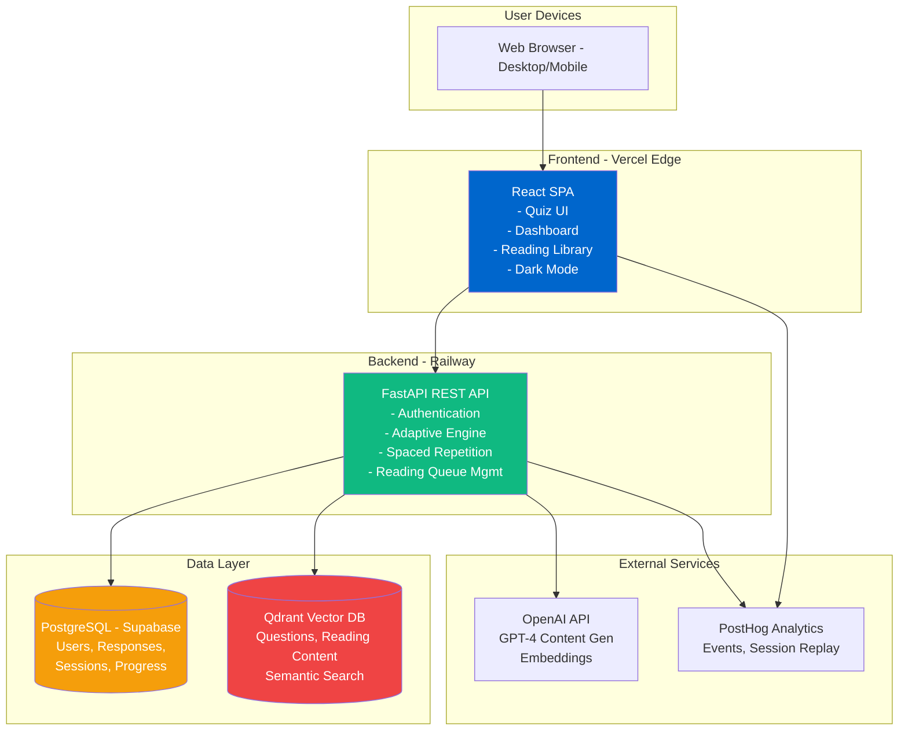

# High Level Architecture

### Technical Summary

LearnR employs a **modern three-tier architecture** with clear separation between presentation (React SPA), business logic (FastAPI REST API), and data persistence (PostgreSQL + Qdrant). The system is designed as a **monolithic backend with microservice-ready boundaries**, allowing future decomposition if needed.

The architecture centers on an **adaptive learning engine** that continuously updates user competency models based on quiz responses, then uses these models to intelligently select questions and reading materials. A **dual-database strategy** leverages PostgreSQL for transactional data (users, responses, sessions) and Qdrant for semantic search (question retrieval, BABOK content matching).

**Frontend** (React SPA) handles all UI/UX concerns including dark mode, responsive design, and real-time progress visualization, communicating exclusively via RESTful API. **Backend** (FastAPI) orchestrates all business logic: adaptive question selection (simplified IRT), competency tracking, spaced repetition scheduling (SM-2), semantic search, and asynchronous reading queue management.

The platform is **cloud-native** with containerized deployment (Docker), designed for initial deployment on cost-effective platforms (Vercel frontend + Railway/Render backend) with clear migration path to AWS/GCP for scale. **PostHog** provides product analytics and session replay for MVP validation.

This architecture achieves PRD goals by: (1) enabling rapid 30-day MVP development through proven tech stack, (2) supporting real-time adaptive learning via efficient competency calculations, (3) providing foundation for multi-certification expansion through modular design, (4) ensuring 80%+ exam pass rates through intelligent content targeting backed by semantic search.

---

### Platform and Infrastructure Choice

**Platform:** Vercel (frontend) + Railway (backend) + Supabase (PostgreSQL) + Qdrant Cloud

**Key Services:**
- Vercel (React SPA hosting with edge CDN)
- Railway (FastAPI backend container with auto-scaling)
- Supabase PostgreSQL (relational data with pgvector fallback option)
- Qdrant Cloud (vector search for questions + reading content)
- PostHog Cloud (analytics, session replay, feature flags)
- GitHub Actions (CI/CD pipeline)

**Deployment Host and Regions:**
- Frontend: Vercel Edge Network (global CDN, primary US)
- Backend: Railway US-West region (low latency to Qdrant Cloud)
- Database: Supabase US-East (PostgreSQL primary + Qdrant Cloud US region)

**Rationale:** Cost-optimized MVP stack ($0-50/month) enables rapid validation with clear migration path to AWS/GCP if business metrics justify investment post-beta.

---

### Repository Structure

**Structure:** Monorepo (single repository, multiple packages)

**Monorepo Tool:** npm workspaces (lightweight, native to Node.js ecosystem)

**Package Organization:**

```
learnr/
├── apps/
│   ├── web/              # React SPA (frontend)
│   └── api/              # FastAPI backend
├── packages/
│   ├── shared-types/     # TypeScript interfaces shared between frontend/backend
│   └── config/           # Shared ESLint, Prettier, TypeScript configs
├── infrastructure/       # Docker, deployment configs, IaC (future)
└── docs/                 # PRD, architecture, API docs
```

---

### High Level Architecture Diagram



---

### Architectural Patterns

- **Single Page Application (SPA):** React SPA with client-side routing - *Rationale:* Fast, app-like UX for quiz sessions; no page reloads during learning flow

- **RESTful API Gateway:** FastAPI as single entry point for all backend operations - *Rationale:* Clear API contract, enables future mobile apps, centralizes auth/logging

- **Repository Pattern (Backend):** Abstract data access layer for PostgreSQL and Qdrant - *Rationale:* Enables testing with mock repositories, future database migration flexibility

- **Component-Based UI (Frontend):** Reusable React components with TypeScript - *Rationale:* Maintainability, type safety, design system consistency (22px/14px border radius hierarchy)

- **Service Layer Pattern (Backend):** Business logic separated from API routes (e.g., AdaptiveEngine, SpacedRepetition services) - *Rationale:* Testability, reusability, clear separation of concerns

- **Event-Driven Background Jobs:** Asynchronous reading queue population via task queue (Celery or FastAPI BackgroundTasks) - *Rationale:* Zero-interruption quiz flow, offload semantic search to background

- **Adapter Pattern (AI Services):** Abstraction layer for OpenAI API (LLMService) - *Rationale:* Enables switching between GPT-4 and Llama 3.1, rate limiting, cost tracking

- **State Management with Context + Hooks (Frontend):** React Context for global state (auth, competency) + local state for UI - *Rationale:* Lightweight for MVP, avoids Redux complexity, sufficient for medium-scale SPA

- **JWT Authentication with Refresh Tokens:** Stateless auth with 7-day expiration - *Rationale:* Scalable, works across devices, secure session management

- **Semantic Search Pattern:** Qdrant for approximate nearest neighbor (ANN) search on question/reading embeddings - *Rationale:* Enables "find similar questions" and "match reading to gaps" features critical to adaptive learning

---

