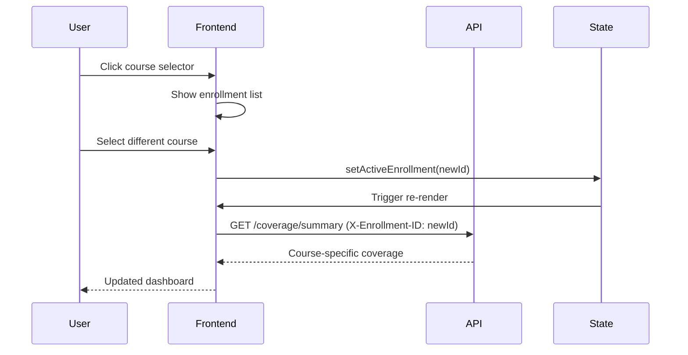

# Multi-Course Platform Architecture

## Status

**DRAFT** - Pending Epic 9 implementation

---

## Executive Summary

This document defines the architectural extensions required to transform LearnR from a single-course CBAP application into a multi-course platform supporting multiple certifications (PSM1, CFA Level 1, etc.). The design maintains full backward compatibility while enabling scalable course expansion.

**Key Design Philosophy:** The BKT engine is course-agnostic. All adaptive learning algorithms work identically across any course - the only changes are data model scoping and API context.

---

## Architecture Goals

| Goal | Description |
|------|-------------|
| **Course Isolation** | Content and progress never leak between courses |
| **Shared Infrastructure** | BKT engine, quiz delivery, reading library work identically |
| **Self-Describing Courses** | Each course defines its own knowledge areas, thresholds, config |
| **Enrollment-Centric** | User progress is per-enrollment, not global |
| **Backward Compatible** | Existing CBAP users experience zero disruption |
| **Extensible** | New courses can be added with configuration, not code changes |

---

## Core Data Model

### Entity Relationship Diagram

```
┌─────────────────────────────────────────────────────────────────────────────┐
│                         MULTI-COURSE DATA MODEL                              │
├─────────────────────────────────────────────────────────────────────────────┤
│                                                                             │
│    ┌──────────────┐         ┌──────────────┐         ┌──────────────┐      │
│    │   courses    │         │    users     │         │ enrollments  │      │
│    ├──────────────┤         ├──────────────┤         ├──────────────┤      │
│    │ id (PK)      │◄───────┐│ id (PK)      │◄───────┐│ id (PK)      │      │
│    │ slug         │        ││ email        │        ││ user_id (FK) │──────┘
│    │ name         │        ││ ...          │        ││ course_id(FK)│──────┐
│    │ knowledge_   │        │└──────────────┘        ││ exam_date    │      │
│    │   areas[]    │        │                        ││ target_score │      │
│    │ thresholds   │        │                        ││ status       │      │
│    └──────┬───────┘        │                        └──────┬───────┘      │
│           │                │                               │               │
│           │ 1:N            │                               │ 1:N          │
│           ▼                │                               ▼               │
│    ┌──────────────┐        │                        ┌──────────────┐      │
│    │   concepts   │        │                        │quiz_sessions │      │
│    ├──────────────┤        │                        ├──────────────┤      │
│    │ id (PK)      │        │                        │ id (PK)      │      │
│    │ course_id(FK)│────────┘                        │enrollment_id │      │
│    │ name         │                                 │ session_type │      │
│    │ knowledge_   │                                 │ ...          │      │
│    │   area_id    │                                 └──────────────┘      │
│    │ ...          │                                                       │
│    └──────┬───────┘                                                       │
│           │                                                                │
│           │ N:M (question_concepts)                                       │
│           ▼                                                                │
│    ┌──────────────┐         ┌──────────────┐         ┌──────────────┐     │
│    │  questions   │         │belief_states │         │reading_chunks│     │
│    ├──────────────┤         ├──────────────┤         ├──────────────┤     │
│    │ id (PK)      │         │ id (PK)      │         │ id (PK)      │     │
│    │ course_id(FK)│         │ user_id (FK) │         │ course_id(FK)│     │
│    │ ...          │         │ concept_id   │─────────│ ...          │     │
│    └──────────────┘         │ alpha, beta  │         └──────────────┘     │
│                             └──────────────┘                              │
│                                                                           │
└───────────────────────────────────────────────────────────────────────────┘
```

### Course Table

The `courses` table is the foundation for multi-course support:

```sql
CREATE TABLE courses (
    id UUID PRIMARY KEY DEFAULT gen_random_uuid(),
    slug VARCHAR(50) UNIQUE NOT NULL,     -- URL-safe identifier: 'cbap', 'psm1'
    name VARCHAR(255) NOT NULL,            -- Display name: 'CBAP Certification Prep'
    description TEXT,                       -- Marketing description
    corpus_name VARCHAR(100),              -- Source material: 'BABOK v3', 'Scrum Guide'

    -- Dynamic Knowledge Area definitions (no hardcoded enum!)
    knowledge_areas JSONB NOT NULL,        -- Array of KA objects

    -- BKT Configuration (per-course thresholds)
    default_diagnostic_count INTEGER DEFAULT 12,
    mastery_threshold FLOAT DEFAULT 0.8,   -- P(mastery) > this = mastered
    gap_threshold FLOAT DEFAULT 0.5,       -- P(mastery) < this = gap
    confidence_threshold FLOAT DEFAULT 0.7, -- confidence > this = classified

    -- Display configuration
    icon_url VARCHAR(500),
    color_hex VARCHAR(7),                  -- Brand color for UI

    -- Status flags
    is_active BOOLEAN DEFAULT TRUE,
    is_public BOOLEAN DEFAULT TRUE,        -- Visible in course catalog

    created_at TIMESTAMP DEFAULT NOW(),
    updated_at TIMESTAMP DEFAULT NOW()
);
```

**Knowledge Areas JSONB Structure:**

```json
{
  "knowledge_areas": [
    {
      "id": "ba-planning",
      "name": "Business Analysis Planning and Monitoring",
      "short_name": "BA Planning",
      "display_order": 1,
      "color": "#3B82F6",
      "icon": "planning"
    },
    {
      "id": "elicitation",
      "name": "Elicitation and Collaboration",
      "short_name": "Elicitation",
      "display_order": 2,
      "color": "#10B981",
      "icon": "collaboration"
    }
  ]
}
```

### Enrollment Table

The `enrollments` table replaces per-user exam settings:

```sql
CREATE TABLE enrollments (
    id UUID PRIMARY KEY DEFAULT gen_random_uuid(),
    user_id UUID NOT NULL REFERENCES users(id) ON DELETE CASCADE,
    course_id UUID NOT NULL REFERENCES courses(id) ON DELETE CASCADE,

    -- Moved from users table (per-enrollment, not per-user)
    exam_date DATE,
    target_score INTEGER,
    daily_study_time INTEGER,              -- Minutes commitment

    -- Enrollment lifecycle
    enrolled_at TIMESTAMP DEFAULT NOW(),
    last_activity_at TIMESTAMP,
    status VARCHAR(20) DEFAULT 'active',   -- active, paused, completed, archived

    -- Progress tracking
    completion_percentage FLOAT DEFAULT 0,

    created_at TIMESTAMP DEFAULT NOW(),
    updated_at TIMESTAMP DEFAULT NOW(),

    UNIQUE (user_id, course_id)            -- One enrollment per course per user
);
```

---

## Course Scoping Strategy

### Content Tables

All content tables receive a `course_id` foreign key:

| Table | Scoping Strategy |
|-------|-----------------|
| `concepts` | Direct `course_id` FK - concepts belong to one course |
| `questions` | Direct `course_id` FK - questions belong to one course |
| `reading_chunks` | Direct `course_id` FK - reading content per course |
| `belief_states` | Implicit via `concept_id` - beliefs scoped by concept's course |
| `quiz_sessions` | Via `enrollment_id` - sessions tied to enrollment |
| `reading_queue` | Via `enrollment_id` - queue per enrollment |
| `responses` | Via `session_id` - responses inherit session's enrollment |

### Query Patterns

**Before (single-course):**
```python
# Get user's belief states
beliefs = query(BeliefState).filter(user_id == current_user.id)

# Get questions for quiz
questions = query(Question).filter(knowledge_area == 'Elicitation')
```

**After (multi-course):**
```python
# Get user's belief states for active enrollment
beliefs = (
    query(BeliefState)
    .join(Concept)
    .filter(BeliefState.user_id == current_user.id)
    .filter(Concept.course_id == active_enrollment.course_id)
)

# Get questions for quiz (course-scoped)
questions = (
    query(Question)
    .filter(Question.course_id == active_enrollment.course_id)
    .filter(Question.knowledge_area_id == ka_id)
)
```

---

## Dynamic Knowledge Areas

### Problem: Hardcoded Enums

Current architecture uses hardcoded TypeScript/Python enums:

```typescript
// BEFORE: Hardcoded CBAP knowledge areas
type KnowledgeArea =
  | 'Business Analysis Planning and Monitoring'
  | 'Elicitation and Collaboration'
  | 'Requirements Life Cycle Management'
  | 'Strategy Analysis'
  | 'Requirements Analysis and Design Definition'
  | 'Solution Evaluation';
```

This breaks when adding PSM1 (different KAs) or CFA (different structure entirely).

### Solution: Course-Driven Configuration

```typescript
// AFTER: Dynamic knowledge areas from course config
interface KnowledgeArea {
  id: string;           // 'ba-planning', 'elicitation'
  name: string;         // Full display name
  short_name: string;   // Abbreviated name for UI
  display_order: number;
  color: string;        // Hex color for progress bars
  icon?: string;        // Icon identifier
}

interface Course {
  id: string;
  slug: string;
  name: string;
  knowledge_areas: KnowledgeArea[];
  // ... other config
}

// Usage: KAs loaded from API, not hardcoded
const { data: course } = useQuery(['course', courseSlug], fetchCourse);
const knowledgeAreas = course.knowledge_areas;
```

### Backend Implementation

```python
class CourseConfigService:
    """Load course configuration including knowledge areas."""

    def __init__(self, course_repository: CourseRepository):
        self._course_repo = course_repository
        self._cache: Dict[str, Course] = {}

    async def get_knowledge_areas(self, course_id: UUID) -> List[KnowledgeArea]:
        """Get knowledge areas for a course from JSONB config."""
        course = await self._get_course_cached(course_id)
        return [
            KnowledgeArea(**ka)
            for ka in course.knowledge_areas
        ]

    async def get_thresholds(self, course_id: UUID) -> BKTThresholds:
        """Get BKT thresholds for a course."""
        course = await self._get_course_cached(course_id)
        return BKTThresholds(
            mastery=course.mastery_threshold,
            gap=course.gap_threshold,
            confidence=course.confidence_threshold
        )
```

---

## API Design Changes

### New Endpoints

#### Course Catalog

```
GET  /api/v1/courses                    # List available courses (public)
GET  /api/v1/courses/{slug}             # Get course details (public)
GET  /api/v1/courses/{slug}/preview     # Course preview with sample content
```

#### Enrollment Management

```
POST   /api/v1/enrollments              # Enroll in course
GET    /api/v1/enrollments              # List user's enrollments
GET    /api/v1/enrollments/{id}         # Get enrollment details
PATCH  /api/v1/enrollments/{id}         # Update enrollment (exam_date, etc.)
DELETE /api/v1/enrollments/{id}         # Archive enrollment
```

### Modified Endpoints

All existing endpoints gain implicit course context via active enrollment:

| Endpoint | Before | After |
|----------|--------|-------|
| `GET /beliefs` | All user beliefs | Beliefs for active enrollment's course |
| `GET /coverage/summary` | Global coverage | Coverage for active enrollment |
| `POST /quiz/next-question` | Any question | Questions from active course |
| `GET /reading-queue` | Global queue | Queue for active enrollment |

### Course Context Header

API requests include course context:

```http
GET /api/v1/coverage/summary
Authorization: Bearer <jwt>
X-Enrollment-ID: <enrollment_uuid>
```

Or via URL prefix (alternative):

```
GET /api/v1/courses/{slug}/coverage/summary
```

---

## Frontend State Management

### Active Enrollment Context

```typescript
// Global state for active enrollment
interface AppState {
  user: User | null;
  enrollments: Enrollment[];
  activeEnrollment: Enrollment | null;
  activeEnrollmentId: string | null;
}

// Context provider
const EnrollmentContext = createContext<{
  activeEnrollment: Enrollment | null;
  setActiveEnrollment: (id: string) => void;
  enrollments: Enrollment[];
}>(null);

// Hook for accessing active course context
function useActiveEnrollment() {
  const context = useContext(EnrollmentContext);
  if (!context.activeEnrollment) {
    throw new Error('No active enrollment - user must select a course');
  }
  return context.activeEnrollment;
}
```

### URL Structure

Course context reflected in URLs for deep linking:

```
/courses                          # Course catalog
/courses/{slug}                   # Course landing page
/courses/{slug}/enroll            # Enrollment flow
/courses/{slug}/dashboard         # Dashboard for enrolled course
/courses/{slug}/quiz              # Quiz for course
/courses/{slug}/reading           # Reading library for course
```

### Course Switching Flow



---

## BKT Engine Modifications

### Course-Agnostic Design

The BKT engine requires **zero algorithm changes** - it operates on concepts, not courses:

```python
class BeliefUpdater:
    """Update beliefs - unchanged from single-course design."""

    async def update_beliefs(
        self,
        user_id: UUID,
        question: Question,  # Question has concept_ids
        is_correct: bool,
        beliefs: Dict[UUID, BeliefState]  # Concept-keyed beliefs
    ) -> Dict[UUID, BeliefState]:
        # Identical algorithm - concepts are pre-filtered by course
        ...
```

### Course Filtering at Service Layer

Course scoping happens at the service/repository layer, not in BKT algorithms:

```python
class QuizService:
    """Quiz orchestration with course context."""

    async def get_next_question(
        self,
        enrollment: Enrollment,
        strategy: str = "max_info_gain"
    ) -> Question:
        # Get beliefs for this enrollment's course
        beliefs = await self.belief_repo.get_for_user_and_course(
            user_id=enrollment.user_id,
            course_id=enrollment.course_id
        )

        # Get questions for this course
        questions = await self.question_repo.get_active_for_course(
            course_id=enrollment.course_id,
            exclude_recent=True
        )

        # BKT selection (course-agnostic)
        return self.question_selector.select_next_question(
            user_id=enrollment.user_id,
            beliefs=beliefs,
            available_questions=questions,
            strategy=strategy
        )
```

### Belief Initialization

When user enrolls in a course, initialize beliefs for all course concepts:

```python
async def initialize_beliefs_for_enrollment(
    enrollment: Enrollment
) -> int:
    """Initialize Beta(1,1) beliefs for all concepts in enrolled course."""
    concepts = await concept_repo.get_all_for_course(enrollment.course_id)

    beliefs = [
        BeliefState(
            user_id=enrollment.user_id,
            concept_id=concept.id,
            alpha=1.0,  # Uninformative prior
            beta=1.0,
            response_count=0
        )
        for concept in concepts
    ]

    return await belief_repo.bulk_create(beliefs)
```

---

## Content Import Pipeline

### Course Content Package Structure

```
courses/
├── cbap/                          # CBAP (existing)
│   ├── course_config.yaml
│   ├── concepts.csv
│   ├── prerequisites.csv
│   ├── questions.csv
│   └── reading_chunks/
│       ├── chapter_1.md
│       └── ...
│
├── psm1/                          # PSM1 (future)
│   ├── course_config.yaml         # Scrum Guide KAs
│   ├── concepts.csv               # Scrum concepts
│   ├── prerequisites.csv
│   ├── questions.csv
│   └── reading_chunks/
│
└── cfa-l1/                        # CFA Level 1 (future)
    ├── course_config.yaml         # CFA topics
    └── ...
```

### Course Config Schema

```yaml
# course_config.yaml
course:
  slug: psm1
  name: Professional Scrum Master I
  description: Prepare for the PSM I certification exam
  corpus_name: Scrum Guide 2020

  icon_url: /images/courses/psm1.svg
  color_hex: "#0052CC"

  # Knowledge areas for this course
  knowledge_areas:
    - id: scrum-theory
      name: Scrum Theory
      short_name: Theory
      display_order: 1
      color: "#0052CC"
    - id: scrum-team
      name: The Scrum Team
      short_name: Team
      display_order: 2
      color: "#10B981"
    - id: scrum-events
      name: Scrum Events
      short_name: Events
      display_order: 3
      color: "#F59E0B"
    - id: scrum-artifacts
      name: Scrum Artifacts
      short_name: Artifacts
      display_order: 4
      color: "#EF4444"

  # BKT thresholds (can differ per course)
  bkt_config:
    mastery_threshold: 0.85        # PSM requires higher mastery
    gap_threshold: 0.5
    confidence_threshold: 0.7
    default_diagnostic_count: 10   # Shorter diagnostic for smaller corpus
```

### Import Script

```python
# scripts/import_course_content.py

async def import_course(course_dir: Path, dry_run: bool = False):
    """Import a complete course package."""

    # 1. Load and validate config
    config = load_course_config(course_dir / "course_config.yaml")
    validate_config(config)

    # 2. Create course record
    course = Course(
        slug=config['course']['slug'],
        name=config['course']['name'],
        knowledge_areas=config['course']['knowledge_areas'],
        # ... other fields
    )

    if not dry_run:
        course = await course_repo.create(course)

    # 3. Import concepts
    concepts = load_concepts_csv(course_dir / "concepts.csv")
    for concept in concepts:
        concept.course_id = course.id

    if not dry_run:
        await concept_repo.bulk_create(concepts)

    # 4. Import prerequisites
    prerequisites = load_prerequisites_csv(course_dir / "prerequisites.csv")
    # ... validate DAG, no cycles

    if not dry_run:
        await prerequisite_repo.bulk_create(prerequisites)

    # 5. Import questions with concept mappings
    questions = load_questions_csv(course_dir / "questions.csv")
    for question in questions:
        question.course_id = course.id
        # Map to concepts via question_concepts junction

    if not dry_run:
        await question_repo.bulk_create(questions)

    # 6. Import reading chunks
    chunks = load_reading_chunks(course_dir / "reading_chunks")
    for chunk in chunks:
        chunk.course_id = course.id

    if not dry_run:
        await chunk_repo.bulk_create(chunks)

    # 7. Generate embeddings
    await generate_embeddings_for_course(course.id)

    # 8. Run validation
    report = await validate_course_content(course.id)

    return report
```

---

## Migration Strategy

### Phase 1: Schema Changes (Non-Breaking)

1. Create `courses` table
2. Create `enrollments` table
3. Add nullable `course_id` to content tables
4. Seed CBAP course record

### Phase 2: Data Migration

1. Create CBAP enrollment for each existing user
2. Set `course_id = CBAP` for all existing content
3. Link quiz_sessions to enrollments
4. Link reading_queue to enrollments

### Phase 3: Code Updates

1. Add course context to API routes
2. Update repositories for course filtering
3. Deploy frontend course selector
4. Default to CBAP for single-enrollment users

### Phase 4: Finalization

1. Make `course_id` NOT NULL
2. Remove deprecated columns from users table
3. Enable course catalog for new enrollments

---

## Backward Compatibility

### Single-Course User Experience

Users with only CBAP enrollment see minimal UI changes:

- No course selector shown (auto-selected)
- Same dashboard, same quiz flow
- URLs can omit `/courses/cbap/` prefix (redirected)

### API Backward Compatibility

Legacy API calls without course context default to user's single enrollment:

```python
@router.get("/coverage/summary")
async def get_coverage_summary(
    enrollment_id: Optional[UUID] = Header(None, alias="X-Enrollment-ID"),
    current_user: User = Depends(get_current_user)
):
    # If no enrollment specified, use single enrollment (backward compat)
    if not enrollment_id:
        enrollments = await enrollment_repo.get_for_user(current_user.id)
        if len(enrollments) == 1:
            enrollment_id = enrollments[0].id
        else:
            raise HTTPException(400, "Multiple enrollments - specify X-Enrollment-ID")

    # ... continue with enrollment context
```

---

## Performance Considerations

### Indexing Strategy

```sql
-- Course lookups
CREATE INDEX idx_courses_slug ON courses(slug);
CREATE INDEX idx_courses_active ON courses(is_active) WHERE is_active = TRUE;

-- Enrollment queries
CREATE INDEX idx_enrollments_user ON enrollments(user_id);
CREATE INDEX idx_enrollments_course ON enrollments(course_id);
CREATE INDEX idx_enrollments_user_active ON enrollments(user_id, status)
    WHERE status = 'active';

-- Content scoping
CREATE INDEX idx_concepts_course ON concepts(course_id);
CREATE INDEX idx_questions_course ON questions(course_id);
CREATE INDEX idx_reading_chunks_course ON reading_chunks(course_id);
```

### Caching Strategy

| Data | Cache TTL | Invalidation |
|------|-----------|--------------|
| Course catalog | 1 hour | On course create/update |
| Course config (KAs, thresholds) | 24 hours | On course update |
| User enrollments | 5 minutes | On enrollment change |
| Belief states | Per-request | On response submission |

---

## Change Log

| Date | Version | Description | Author |
|------|---------|-------------|--------|
| 2025-12-08 | 1.0 | Initial multi-course architecture specification | Winston (Architect) |
