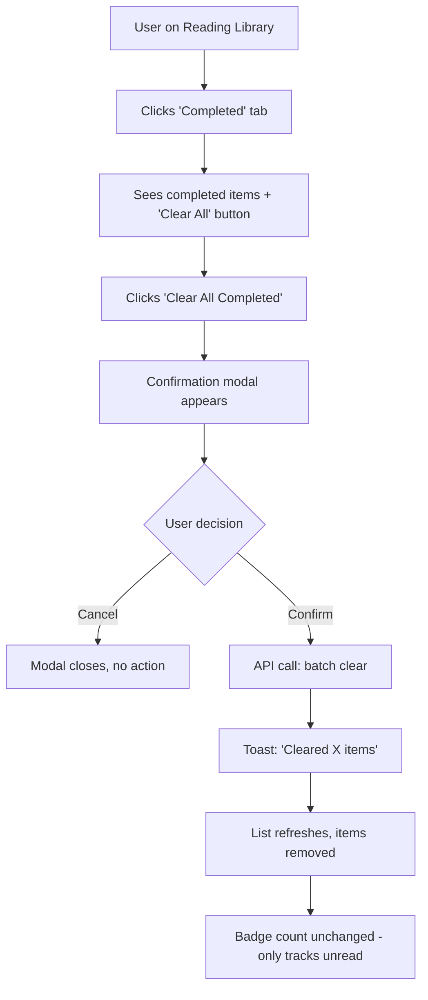
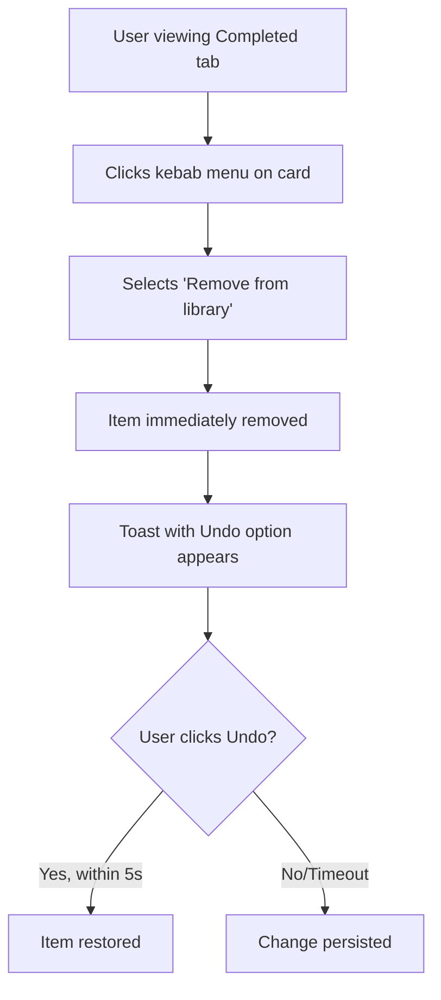

# Delete Completed Reading Materials - UI/UX Specification

## Overview

**Feature:** Allow users to remove completed reading materials from their library
**Purpose:** Keep the reading library focused on weak areas and reduce visual clutter
**Approach:** Soft delete via "cleared" status (preserves analytics data)

---

## User Goals & Principles

### User Goal
> "I want to clear out completed readings so my library only shows what I still need to learn."

### Design Principles Applied
| Principle | Application |
|-----------|-------------|
| Progressive Disclosure | Delete options only appear on Completed tab |
| Prevent Errors | Batch delete requires confirmation; single delete has undo |
| User Control | Both individual and batch options available |
| Immediate Feedback | Toast notifications confirm all actions |

---

## User Flow

### Flow 1: Clear All Completed Items (Batch)



### Flow 2: Clear Single Item



---

## Component Specifications

### 1. Clear All Button

**Location:** Reading Library page, Completed tab filter bar
**Visibility:** Only when `status === 'completed'` AND `items.length > 0`

```
┌─────────────────────────────────────────────────────────────┐
│  [Unread (5)]  [Reading (2)]  [Completed (12)]              │
│                                                              │
│  Sort by: Priority ▾    KA: All ▾    [Clear All Completed]  │
└─────────────────────────────────────────────────────────────┘
```

**Button Specs:**
| Property | Value |
|----------|-------|
| Variant | `outline` or `ghost` with destructive styling |
| Icon | Trash icon (left of text) |
| Text | "Clear All Completed" or "Clear {count} Completed" |
| Color | Muted/secondary (not aggressive red) |
| Hover | Subtle red tint |

**States:**
- Default: Visible with item count
- Loading: Disabled + spinner, text changes to "Clearing..."
- Hidden: When no completed items exist

---

### 2. Confirmation Modal

**Trigger:** Click "Clear All Completed" button

```
┌──────────────────────────────────────────────────────────────┐
│                                                              │
│   Clear Completed Reading Materials?                         │
│                                                              │
│   This will remove 12 items from your library.               │
│   Your reading progress and statistics are preserved.        │
│                                                              │
│                          [Cancel]  [Clear Items]             │
│                                                              │
└──────────────────────────────────────────────────────────────┘
```

**Modal Specs:**
| Element | Specification |
|---------|---------------|
| Title | "Clear Completed Reading Materials?" |
| Body | Dynamic count, reassurance about preserved data |
| Cancel | Secondary/ghost button, left position |
| Confirm | Primary button with subtle destructive styling |
| Backdrop | Click outside to dismiss |
| Keyboard | Escape to close, Enter to confirm |

---

### 3. Kebab Menu on Completed Cards

**Location:** Top-right corner of `ReadingCard` component
**Visibility:** Only on cards with `status === 'completed'`

```
┌─────────────────────────────────────┐
│  ✓ Completed                   [⋮] │  ← Kebab menu
│  Stakeholder Analysis               │
│  Business Analysis                  │
│  5 min read                         │
│                      [Review Again] │
└─────────────────────────────────────┘
```

**Menu Items:**
| Item | Icon | Action |
|------|------|--------|
| Remove from library | Trash | Clears item, shows undo toast |

**Future Consideration:** Could add "Move back to Unread" option

---

### 4. Undo Toast Notification

**Trigger:** Single item removal via kebab menu

```
┌──────────────────────────────────────────────────┐
│  ✓  Item removed from library          [Undo]   │
└──────────────────────────────────────────────────┘
```

**Toast Specs:**
| Property | Value |
|----------|-------|
| Duration | 5000ms (5 seconds) |
| Position | Bottom-right (consistent with existing toasts) |
| Action | "Undo" button restores item |
| Icon | Checkmark (success) |

---

### 5. Success Toast (Batch Clear)

**Trigger:** Successful batch clear operation

```
┌──────────────────────────────────────────────────┐
│  ✓  Cleared 12 items from your library          │
└──────────────────────────────────────────────────┘
```

**Note:** No undo for batch operations (too complex, confirmation modal serves as gate)

---

## State Management

### New Status Value
Add `cleared` to the existing status enum:
```
status: 'unread' | 'reading' | 'completed' | 'dismissed' | 'cleared'
```

**Alternative:** Reuse `dismissed` status for cleared items (simpler, no schema change)

### React Query Invalidation
On successful clear operation:
1. Invalidate `['reading-queue', ...]` queries
2. No badge update needed (badge only tracks `unread`)

### Optimistic Updates (Single Item)
1. Immediately remove item from UI
2. Make API call
3. On failure: restore item, show error toast
4. On success: keep removed state

---

## API Contract

### Clear Single Item
```
PUT /reading/queue/{queue_id}/status
Request: { "status": "cleared" }
Response: { "queue_id": "...", "status": "cleared", "cleared_at": "..." }
```

**Alternative (reuse existing):**
```
PUT /reading/queue/{queue_id}/status
Request: { "status": "dismissed" }
```

### Batch Clear Completed
```
POST /reading/queue/batch-clear
Request: { "queue_ids": ["uuid1", "uuid2", ...] }  // max 100
Response: { "cleared_count": 12, "remaining_completed_count": 0 }
```

**Alternative (extend existing batch-dismiss):**
```
POST /reading/queue/batch-dismiss
Request: { "queue_ids": [...], "source": "completed_clear" }
```

---

## Accessibility Requirements

| Requirement | Implementation |
|-------------|----------------|
| Keyboard navigation | All actions accessible via Tab + Enter |
| Focus management | Return focus to filter bar after modal closes |
| Screen reader | Announce "X items cleared" after batch action |
| Button labels | `aria-label="Clear all 12 completed items"` |
| Modal | Focus trap, Escape to close |

---

## Edge Cases

| Scenario | Behavior |
|----------|----------|
| Clear with 0 completed items | Button hidden |
| Network failure during clear | Show error toast, restore items |
| User navigates away during clear | Complete operation in background |
| Undo after navigation | Not supported (toast dismissed on navigate) |
| 100+ completed items | Paginate batch calls if needed |

---

## Implementation Checklist

- [ ] Add "Clear All Completed" button to `ReadingFilterBar.tsx`
- [ ] Create confirmation modal component
- [ ] Add kebab menu to `ReadingCard.tsx` for completed items
- [ ] Implement undo toast with restore functionality
- [ ] Add `clearCompleted` mutation to `useReadingQueue` hook
- [ ] Create/extend API endpoint for batch clear
- [ ] Add optimistic update for single item removal
- [ ] Test keyboard navigation and screen reader
- [ ] Add loading states for button and modal

---

## Files to Modify

| File | Changes |
|------|---------|
| `ReadingFilterBar.tsx` | Add Clear All button |
| `ReadingCard.tsx` | Add kebab menu for completed cards |
| `readingService.ts` | Add clearCompleted API method |
| `useReadingQueue.ts` | Add mutation for clear operations |
| API: `reading_queue_router.py` | Add batch-clear endpoint (or extend batch-dismiss) |
| API: `reading_queue_repository.py` | Add clear method |

---

*Document created by Sally, UX Expert*
*Feature: Delete Completed Reading Materials*
