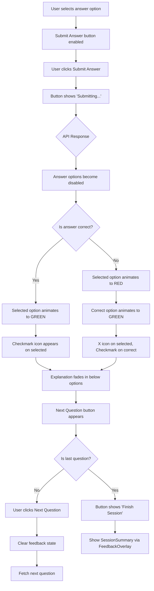

# Front-End Specification: Inline Quiz Answer Feedback

> **Feature:** Inline Quiz Answer Feedback
> **Story:** [inline-quiz-feedback.md](./stories/inline-quiz-feedback.md)
> **Version:** 1.0
> **Date:** 2025-12-26
> **Author:** Sally (UX Expert)

---

## 1. Introduction

### Purpose & Scope

This specification defines the user experience and visual design for the **Inline Quiz Answer Feedback** feature for LearnR. It replaces the current `FeedbackOverlay` approach with in-context answer highlighting, providing learners with immediate visual feedback while maintaining visibility of the question and all answer options.

### UX Goals & Principles

**Target User:**
- **Learner:** Primary user taking quizzes to reinforce knowledge. Values immediate feedback, clear visual cues, and minimal disruption to learning flow.

**Usability Goals:**
- **Contextual clarity:** Feedback is shown alongside the question for better comprehension
- **Immediate reinforcement:** Visual feedback appears within 300ms of submission
- **Progressive disclosure:** Explanation appears after answer highlight, not simultaneously

**Design Principles:**
1. **Continuity over disruption** - Keep question visible during feedback
2. **Immediate feedback** - Visual confirmation within 300ms
3. **Accessible by default** - Color + icons for all users
4. **Consistent patterns** - Reuse existing color tokens (green-50/600, red-50/600)

---

## 2. User Flow - Answer Submission & Feedback

### User Goal
Submit an answer and receive immediate, contextual feedback to reinforce learning.

### Entry Point
User has selected an answer option and clicks "Submit Answer" button.

### Flow Diagram



### Success Criteria
- User sees colored highlight within 300ms of API response
- User can view question text and all options while reading explanation
- User clearly understands which answer was correct (even if they got it wrong)

### Edge Cases & Error Handling

| Scenario | Handling |
|----------|----------|
| Network error during submit | Show error toast; keep answer selected; enable retry |
| Slow API response (>2s) | "Submitting..." state remains; consider skeleton pulse |
| Very long explanation text | Scrollable container; max-height with overflow |
| Reduced motion preference | Skip animations; show final state immediately |

---

## 3. Component Specifications

### 3.1 Answer Option States

| State | Background | Border | Text | Icon | Interaction |
|-------|------------|--------|------|------|-------------|
| **Default** | `white` | `border-gray-200` | `text-gray-900` | None | Clickable, hover effect |
| **Hover** | `gray-50` | `border-gray-300` | `text-gray-900` | None | Cursor pointer |
| **Selected** | `primary-50` | `border-primary-500` | `text-gray-900` | Radio filled | Clickable to deselect |
| **Disabled** | `gray-50` | `border-gray-200` | `text-gray-500` | None | `cursor-not-allowed` |
| **Correct (feedback)** | `green-50` | `border-green-500` (2px) | `text-green-800` | ✓ Checkmark | Disabled |
| **Incorrect (feedback)** | `red-50` | `border-red-500` (2px) | `text-red-800` | ✗ X mark | Disabled |

### 3.2 Correct Answer Option (Post-Submit)

```
┌─────────────────────────────────────────────────────────┐
│  ✓  B. Mitochondria                                     │
│     ────────────────                                    │
│     [green-50 bg, green-500 border, green checkmark]    │
└─────────────────────────────────────────────────────────┘
```

**Tailwind Classes:**
```css
bg-green-50 border-2 border-green-500 text-green-800
rounded-[14px] p-4 transition-all duration-300 ease-in-out
```

**Icon:** `CheckIcon` (reuse from `FeedbackOverlay.tsx`)
- Size: `w-5 h-5`
- Color: `text-green-600`
- Position: Left of answer text, replacing radio button

### 3.3 Incorrect Answer Option (Post-Submit)

```
┌─────────────────────────────────────────────────────────┐
│  ✗  A. Nucleus                                          │
│     ───────────                                         │
│     [red-50 bg, red-500 border, red X icon]             │
└─────────────────────────────────────────────────────────┘
```

**Tailwind Classes:**
```css
bg-red-50 border-2 border-red-500 text-red-800
rounded-[14px] p-4 transition-all duration-300 ease-in-out
```

**Icon:** `XIcon` (reuse from `FeedbackOverlay.tsx`)
- Size: `w-5 h-5`
- Color: `text-red-600`
- Position: Left of answer text, replacing radio button

### 3.4 Neutral Option (Post-Submit, Not Selected, Not Correct)

Options that were neither selected nor correct become neutral/disabled:

```css
bg-gray-50 border border-gray-200 text-gray-400
rounded-[14px] p-4 opacity-60 cursor-not-allowed
```

### 3.5 Inline Explanation Component

Appears below the answer options after feedback:

```
┌─────────────────────────────────────────────────────────┐
│  Explanation                                            │
│  ───────────────────────────────────────────────────    │
│  The mitochondria is known as the powerhouse of the     │
│  cell because it generates most of the cell's supply    │
│  of ATP, used as a source of chemical energy.           │
└─────────────────────────────────────────────────────────┘
```

**Styling:**
```css
bg-gray-50 border border-gray-200 rounded-[14px] p-4 mt-4
animate-fadeIn (custom animation)
```

**Typography:**
- Label: `text-sm font-medium text-gray-700 mb-1`
- Body: `text-sm text-gray-800 leading-relaxed`

### 3.6 Next Question Button (Post-Feedback)

Appears below the explanation:

```css
mt-4 w-full py-3 px-6 rounded-[14px] font-medium
bg-primary-600 hover:bg-primary-700 text-white
transition-colors focus:outline-none focus:ring-2
focus:ring-primary-500 focus:ring-offset-2
```

**Variants:**
- Default: "Next Question"
- Last question: "Finish Session" (triggers `FeedbackOverlay` with session summary)

---

## 4. Animation & Micro-interactions

### 4.1 Motion Principles

| Principle | Application |
|-----------|-------------|
| **Purposeful** | Animations guide attention to feedback, not decorate |
| **Quick** | Total feedback sequence completes in 400ms to feel instant |
| **Sequential** | Highlight → Icon → Explanation creates reading order |
| **Respectful** | Honor `prefers-reduced-motion` system preference |

### 4.2 Animation Sequence Timeline

```
Time (ms)    0       100      200      300      400
             │        │        │        │        │
Submit ──────┤
             │
Highlight ───┴────────────────┐
             [duration: 200ms]│
             [ease-in-out]    │
                              │
Icon ────────────┴────────────────┐
                 [delay: 100ms]   │
                 [duration: 150ms]│
                 [ease-out]       │
                                  │
Explanation ─────────────────────┴────────────────┐
                                  [delay: 200ms]  │
                                  [duration: 200ms│
                                  [ease-out]      │
                                                  │
Button ───────────────────────────────────────────┴
                                      [with explanation]
```

### 4.3 Individual Animation Specifications

#### Answer Option Highlight

| Property | Value |
|----------|-------|
| **Trigger** | `feedbackResult` received from API |
| **Properties** | `background-color`, `border-color`, `color` |
| **Duration** | 200ms |
| **Easing** | `ease-in-out` |
| **Tailwind** | `transition-all duration-200 ease-in-out` |

#### Icon Appearance

| Property | Value |
|----------|-------|
| **Trigger** | Highlight animation starts |
| **Properties** | `opacity`, `transform` (scale) |
| **Duration** | 150ms |
| **Delay** | 100ms (overlaps with highlight) |
| **Easing** | `ease-out` |
| **Effect** | Fade in + subtle scale from 0.8 → 1.0 |

**CSS Implementation:**
```css
@keyframes icon-appear {
  from {
    opacity: 0;
    transform: scale(0.8);
  }
  to {
    opacity: 1;
    transform: scale(1);
  }
}

.feedback-icon {
  animation: icon-appear 150ms ease-out 100ms both;
}
```

#### Explanation Fade-In

| Property | Value |
|----------|-------|
| **Trigger** | Highlight animation completes |
| **Properties** | `opacity`, `transform` (translateY) |
| **Duration** | 200ms |
| **Delay** | 200ms (after highlight) |
| **Easing** | `ease-out` |
| **Effect** | Fade in + slide up 8px |

**CSS Implementation:**
```css
@keyframes fade-slide-in {
  from {
    opacity: 0;
    transform: translateY(8px);
  }
  to {
    opacity: 1;
    transform: translateY(0);
  }
}

.inline-explanation {
  animation: fade-slide-in 200ms ease-out 200ms both;
}
```

### 4.4 Reduced Motion Support

For users with `prefers-reduced-motion: reduce`:

```css
@media (prefers-reduced-motion: reduce) {
  .answer-option,
  .feedback-icon,
  .inline-explanation,
  .next-button {
    animation: none !important;
    transition: none !important;
  }
}
```

**Behavior:** All elements appear immediately in their final state. No motion, but full visual feedback (colors, icons) still present.

**React Implementation:**
```tsx
const prefersReducedMotion = window.matchMedia(
  '(prefers-reduced-motion: reduce)'
).matches

const animationClass = prefersReducedMotion
  ? ''
  : 'animate-fade-slide-in'
```

### 4.5 Performance Considerations

| Concern | Mitigation |
|---------|------------|
| **GPU acceleration** | Use `transform` and `opacity` (compositor-only properties) |
| **Layout thrashing** | Avoid animating `width`, `height`, `padding` |
| **Jank on low-end devices** | 300ms duration is forgiving; test on throttled CPU |
| **Memory** | Simple keyframes, no complex sequences |

---

## 5. Accessibility Requirements

### 5.1 Compliance Target

**Standard:** WCAG 2.1 Level AA

### 5.2 Color & Contrast

#### Color Alone Is Not Sufficient

Colors must be paired with icons to ensure colorblind users can distinguish correct from incorrect:

| State | Color | Icon | Text Indicator |
|-------|-------|------|----------------|
| Correct | Green (`green-500`) | ✓ Checkmark | None needed (icon is clear) |
| Incorrect | Red (`red-500`) | ✗ X mark | None needed (icon is clear) |
| Correct answer (when user was wrong) | Green (`green-500`) | ✓ Checkmark | Optional: "Correct answer" label |

#### Contrast Ratios

All color combinations meet WCAG AA (4.5:1 for normal text, 3:1 for large text):

| Element | Foreground | Background | Ratio | Pass |
|---------|------------|------------|-------|------|
| Correct text | `green-800` (#166534) | `green-50` (#f0fdf4) | 7.2:1 | AA |
| Incorrect text | `red-800` (#991b1b) | `red-50` (#fef2f2) | 7.1:1 | AA |
| Explanation text | `gray-800` (#1f2937) | `gray-50` (#f9fafb) | 12.6:1 | AAA |
| Icon (correct) | `green-600` (#16a34a) | `green-50` (#f0fdf4) | 4.8:1 | AA |
| Icon (incorrect) | `red-600` (#dc2626) | `red-50` (#fef2f2) | 4.6:1 | AA |

### 5.3 Screen Reader Support

#### Live Region Announcement

When feedback is shown, announce the result to screen readers:

```tsx
<div
  role="status"
  aria-live="polite"
  aria-atomic="true"
  className="sr-only"
>
  {isCorrect
    ? "Correct! Your answer was right."
    : `Incorrect. The correct answer is ${correctAnswer}.`}
</div>
```

#### Answer Option ARIA

After submission, update answer options with result semantics:

```tsx
// Correct answer (user selected)
<div
  role="listitem"
  aria-label="Option B: Mitochondria. Correct answer. Your selection."
  aria-selected="true"
  aria-disabled="true"
>

// Incorrect answer (user selected)
<div
  role="listitem"
  aria-label="Option A: Nucleus. Incorrect. Your selection."
  aria-selected="true"
  aria-disabled="true"
>

// Correct answer (user didn't select)
<div
  role="listitem"
  aria-label="Option B: Mitochondria. This was the correct answer."
  aria-disabled="true"
>
```

### 5.4 Focus Management

#### Focus Sequence After Submission

1. User clicks "Submit Answer"
2. Button becomes disabled, shows "Submitting..."
3. Feedback appears
4. **Focus moves to:** Explanation section (programmatic focus)
5. User can Tab to "Next Question" button

**Implementation:**
```tsx
useEffect(() => {
  if (showFeedback && explanationRef.current) {
    const timer = setTimeout(() => {
      explanationRef.current?.focus()
    }, 350) // After highlight animation
    return () => clearTimeout(timer)
  }
}, [showFeedback])
```

### 5.5 Keyboard Navigation

| Key | Action |
|-----|--------|
| `Tab` | Move focus: Explanation → Next Question button → Session controls |
| `Shift+Tab` | Reverse navigation |
| `Enter` / `Space` | Activate "Next Question" button |

### 5.6 Touch Targets

All interactive elements meet 44x44px minimum:

| Element | Minimum Size | Current Size | Pass |
|---------|--------------|--------------|------|
| Answer option | 44x44px | Full width, ~56px height | Yes |
| Next Question button | 44x44px | Full width, 48px height | Yes |
| Session control buttons | 44x44px | 44px height | Yes |

### 5.7 Testing Checklist

| Test | Method | Acceptance |
|------|--------|------------|
| Screen reader announcement | VoiceOver / NVDA | Correct/incorrect status announced on submit |
| Color blindness | Sim Daltonism / browser filter | Icons clearly distinguish correct from incorrect |
| Keyboard-only navigation | Unplug mouse | Can complete full quiz flow with keyboard |
| Focus visibility | Visual inspection | Focus ring visible on all interactive elements |
| Reduced motion | System preference ON | No animations, instant state changes |
| Zoom 200% | Browser zoom | Layout remains usable, no overlap |

---

## 6. Responsiveness Strategy

### 6.1 Breakpoints

| Breakpoint | Min Width | Target Devices | Quiz Layout |
|------------|-----------|----------------|-------------|
| **Mobile** | 0px | Phones (portrait) | Single column, stacked |
| **sm** | 640px | Phones (landscape), small tablets | Single column, more padding |
| **md** | 768px | Tablets | Comfortable spacing |
| **lg** | 1024px | Laptops, desktops | Centered container, max-width |
| **xl** | 1280px | Large desktops | Same as lg, more whitespace |

### 6.2 Mobile Layout (< 640px)

```
┌─────────────────────────────┐
│ ← Back         QuizProgress │
├─────────────────────────────┤
│  Question text goes here    │
│  and can wrap to multiple   │
│  lines on mobile screens    │
├─────────────────────────────┤
│ ┌─────────────────────────┐ │
│ │ ✓ A. Option one         │ │
│ └─────────────────────────┘ │
│ ┌─────────────────────────┐ │
│ │ ✗ B. Option two         │ │
│ └─────────────────────────┘ │
│ ┌─────────────────────────┐ │
│ │   C. Option three       │ │
│ └─────────────────────────┘ │
│ ┌─────────────────────────┐ │
│ │   D. Option four        │ │
│ └─────────────────────────┘ │
├─────────────────────────────┤
│ ┌─────────────────────────┐ │
│ │ Explanation             │ │
│ │ The mitochondria is...  │ │
│ │ [scrollable if long]    │ │
│ └─────────────────────────┘ │
├─────────────────────────────┤
│ ┌─────────────────────────┐ │
│ │     Next Question       │ │
│ └─────────────────────────┘ │
├─────────────────────────────┤
│ [Pause]         [End]       │
└─────────────────────────────┘
```

**Mobile-Specific Styles:**
```css
.answer-option {
  @apply w-full p-4 text-base;
}

.inline-explanation {
  @apply w-full p-4 mt-4;
  max-height: 40vh;
  overflow-y: auto;
}

.next-button {
  @apply w-full py-3 text-base;
}
```

### 6.3 Tablet Layout (768px - 1023px)

```css
@screen md {
  .answer-option {
    @apply p-5;
  }

  .inline-explanation {
    max-height: 50vh;
    @apply p-5;
  }

  .next-button {
    @apply w-auto px-12;
  }
}
```

### 6.4 Desktop Layout (1024px+)

```css
@screen lg {
  .quiz-container {
    @apply max-w-2xl mx-auto;
  }

  .inline-explanation {
    max-height: none;
  }
}
```

### 6.5 Responsive Behavior Summary

| Element | Mobile | Tablet | Desktop |
|---------|--------|--------|---------|
| **Container width** | 100% - padding | 100% - padding | max-w-2xl centered |
| **Answer option padding** | `p-4` (16px) | `p-5` (20px) | `p-5` (20px) |
| **Explanation max-height** | 40vh (scrollable) | 50vh (scrollable) | None (full height) |
| **Next button width** | Full width | Auto (centered) | Auto (centered) |
| **Icon size** | `w-5 h-5` | `w-5 h-5` | `w-5 h-5` |
| **Font size** | `text-base` (16px) | `text-base` (16px) | `text-base` (16px) |

### 6.6 Orientation Considerations

**Landscape (Mobile):**
```css
@media (orientation: landscape) and (max-height: 500px) {
  .inline-explanation {
    max-height: 30vh;
  }

  .session-controls {
    @apply sticky bottom-0 bg-white border-t;
  }
}
```

---

## 7. Implementation Summary

### 7.1 Implementation Checklist

| Task | Priority | Complexity | Files Affected |
|------|----------|------------|----------------|
| Extract `CheckIcon` and `XIcon` to shared components | High | Low | `components/shared/icons/` |
| Create answer option feedback states | High | Medium | `QuizPage.tsx` or new `QuizAnswerOption.tsx` |
| Add CSS animations/keyframes | High | Low | `globals.css` or Tailwind config |
| Implement `prefers-reduced-motion` check | High | Low | Hook or utility |
| Create `InlineExplanation` component | High | Low | `components/quiz/InlineExplanation.tsx` |
| Update `QuizPage` to use inline feedback | High | Medium | `QuizPage.tsx` |
| Modify `FeedbackOverlay` trigger to session summary only | Medium | Low | `QuizPage.tsx` |
| Add screen reader live region | High | Low | `QuizPage.tsx` |
| Add focus management to explanation | Medium | Low | `QuizPage.tsx` |
| Update unit tests | Medium | Medium | `tests/` |
| Mobile viewport testing | High | Low | Manual QA |
| Accessibility testing | High | Medium | Manual QA + automated |

### 7.2 Component Architecture

```
QuizPage.tsx
├── QuizProgress (unchanged)
├── QuestionCard
│   └── QuizAnswerOption (new/modified)
│       ├── Default state
│       ├── Selected state
│       ├── Correct feedback state (green + ✓)
│       ├── Incorrect feedback state (red + ✗)
│       └── Neutral disabled state
├── InlineExplanation (new)
│   ├── Explanation text
│   └── Next Question button
├── FeedbackOverlay (session summary only)
└── SessionControls (unchanged)
```

### 7.3 New/Modified Files

| File | Action | Description |
|------|--------|-------------|
| `components/shared/icons/CheckIcon.tsx` | Create | Extract from FeedbackOverlay |
| `components/shared/icons/XIcon.tsx` | Create | Extract from FeedbackOverlay |
| `components/quiz/QuizAnswerOption.tsx` | Create | Encapsulate answer option states |
| `components/quiz/InlineExplanation.tsx` | Create | Explanation + Next button |
| `components/quiz/FeedbackOverlay.tsx` | Modify | Keep for session summary only |
| `pages/QuizPage.tsx` | Modify | Integrate inline feedback |
| `hooks/useReducedMotion.ts` | Create | Detect motion preference |
| `styles/animations.css` | Create/Modify | Custom keyframes |

### 7.4 Design Tokens Summary

**Colors:**
```
Correct:    bg-green-50, border-green-500, text-green-800, icon: text-green-600
Incorrect:  bg-red-50, border-red-500, text-red-800, icon: text-red-600
Neutral:    bg-gray-50, border-gray-200, text-gray-400, opacity-60
Explanation: bg-gray-50, border-gray-200, text-gray-800
```

**Animation:**
```
Highlight:   duration-300, ease-in-out
Icon:        duration-200, delay-150, ease-out, scale 0.8→1
Explanation: duration-300, delay-300, ease-out, translateY 8px→0
Button:      duration-200, delay-400, ease-out
```

**Spacing:**
```
Option padding:     p-4 (mobile), p-5 (tablet+)
Explanation margin: mt-4
Button margin:      mt-4
Border radius:      rounded-[14px] (consistent with existing)
```

### 7.5 Design Handoff Checklist

- [x] User flow documented with decision points
- [x] Component states fully specified
- [x] Animation timing and easing defined
- [x] Accessibility requirements clear
- [x] Responsive behavior documented
- [x] Color tokens and design system alignment confirmed
- [x] Edge cases identified

---

## Change Log

| Date | Version | Description | Author |
|------|---------|-------------|--------|
| 2025-12-26 | 1.0 | Initial specification | Sally (UX Expert) |
